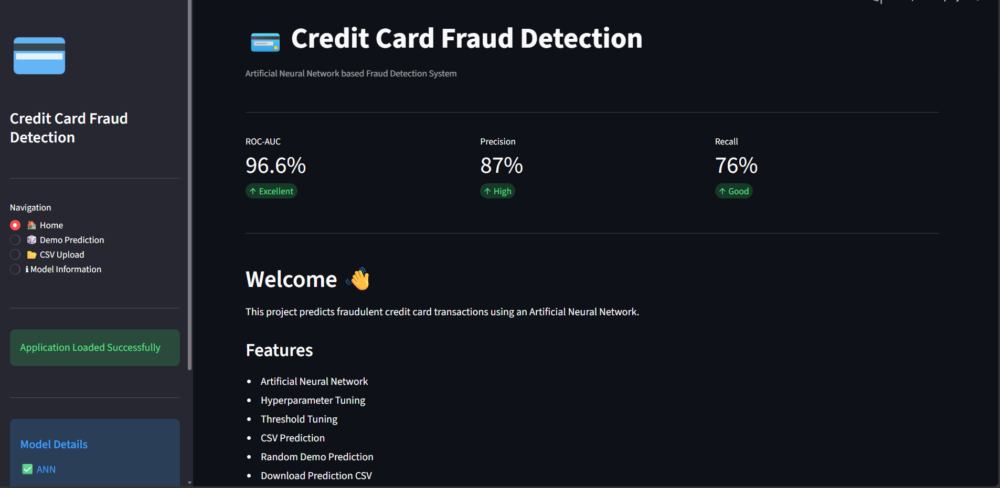
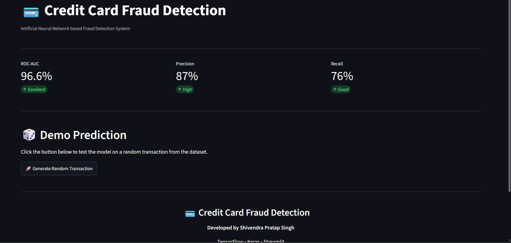
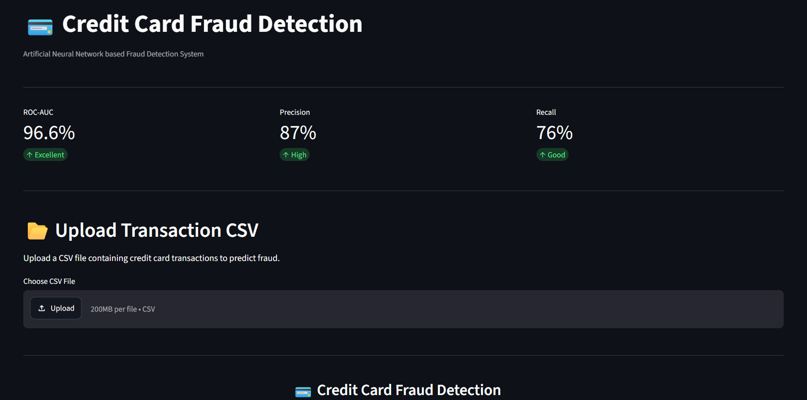
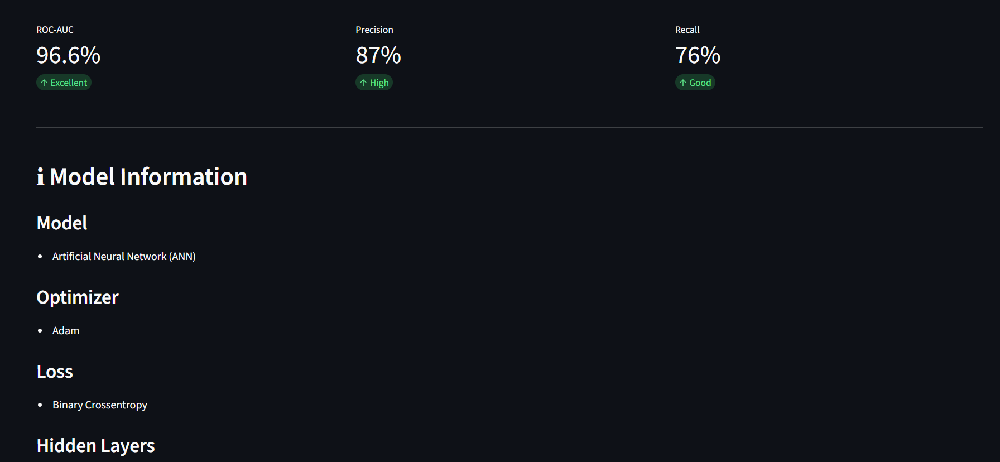

# 💳 Credit Card Fraud Detection using Artificial Neural Network (ANN)

An end-to-end Machine Learning project that detects fraudulent credit card transactions using an Artificial Neural Network (ANN). The project includes data preprocessing, hyperparameter tuning, threshold tuning, model evaluation, and a professional Streamlit web application for real-time predictions.

---

## 🚀 Live Demo

https://credit-card-fraud-detection-ann.onrender.com/

---

## 📌 Project Overview

Credit card fraud is a highly imbalanced classification problem where fraudulent transactions are very rare compared to genuine ones.

In this project, an ANN model was trained to accurately identify fraudulent transactions while minimizing false negatives. The final model is deployed using Streamlit for an interactive user experience.

---

## ✨ Features

- Artificial Neural Network (ANN)
- Data Preprocessing
- StandardScaler
- Hyperparameter Tuning (Keras Tuner)
- Dropout & L2 Regularization
- Early Stopping
- Threshold Tuning
- ROC-AUC Evaluation
- Precision / Recall / F1 Score
- Streamlit Dashboard
- CSV Upload Prediction
- Random Transaction Demo
- Download Prediction CSV

---

## 🛠 Tech Stack

- Python
- TensorFlow / Keras
- NumPy
- Pandas
- Scikit-Learn
- Plotly
- Streamlit
- Joblib

---

## 📂 Project Structure

```text
Credit-Card-Fraud-Detection/
│
├── app.py
├── requirements.txt
├── README.md
├── .gitignore
├── creditcard.csv
│
├── models/
│   ├── credit_card_fraud_model.keras
│   └── scaler.pkl
│
└── screenshots/
```

---

## 🧠 Model Architecture

```
Input Layer (30 Features)
        │
        ▼
Dense Layer (ReLU)
        │
     Dropout
        │
Dense Layer (ReLU)
        │
     Dropout
        │
Output Layer (Sigmoid)
```

---

## 📊 Model Performance

| Metric | Score |
|---------|-------|
| ROC-AUC | **96.6%** |
| Precision | **87%** |
| Recall | **76%** |

---

## 🖥 Streamlit Dashboard

The application provides:

- Home Dashboard
- Demo Prediction
- CSV Upload Prediction
- Model Information
- Fraud Probability
- Prediction Confidence
- Download Prediction CSV

---

## ⚙ Installation

Clone the repository

```bash
git clone https://github.com/Shivendra1230/Credit-Card-Fraud-Detection-ANN.git
```

Move into project

```bash
cd Credit-Card-Fraud-Detection
```

Install dependencies

```bash
pip install -r requirements.txt
```

Run Streamlit

```bash
streamlit run app.py
```

---

## 📸 Screenshots

### 🏠 Home Page

### 🏠 Home Page



---

### 🎲 Demo Prediction



---

### 📂 CSV Upload



---

### ℹ Model Information



---

## 📈 Future Improvements

- XGBoost Comparison
- Explainable AI (SHAP)
- Docker Support
- Cloud Deployment
- REST API using FastAPI

---

## 👨‍💻 Author

**Shivendra Pratap Singh**

B.Tech Computer Science Engineering

Machine Learning | Deep Learning | Generative AI

GitHub: https://github.com/Shivendra1230


LinkedIn:  www.linkedin.com/in/shivendra-pratap-singh-8bab22237


## ⭐ If you like this project

Please consider giving it a ⭐ on GitHub.